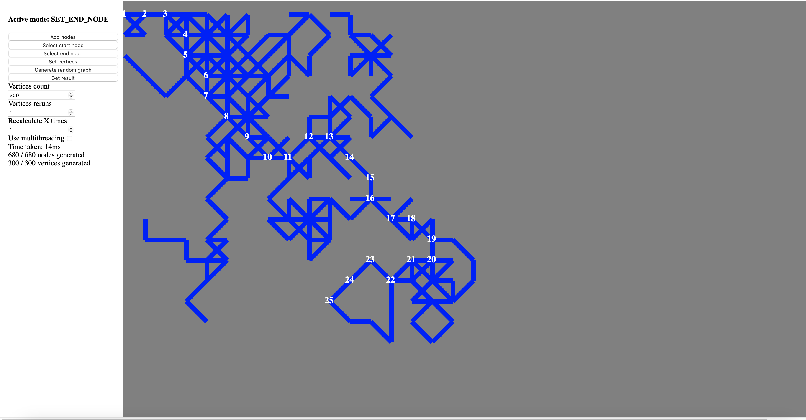

# A* Pathfinding   

## Description 
A small toy project with acceptable Golang backend code and total spaghetti JavaScript frontend code.  
Made for fun to learn a little bit of Go and to try out the A* pathfinding algorithm.  

## Usage  

These are suggested steps for a typical usage:  

1. Run the project (go run main.go) and go to localhost:8080.  
2. In the interface, choose desired "vertices count", 100 is a good number to start.    
3. Click on "Generate random graph" and wait for completion.    
4. To benchmark* Go, you can increase "Recalculate X times", 10000 for example.  
5. To run the execution with Goroutines, check "Use multithreading".  
6. Click "Select start node" and select the start node.  
7. Click "Select end node" and select the end node.  
8. Click "Get result" to get the path.  

You can click "Get result" multiple times and for example disable and enable multithreading to see the speed difference with and without it.  

*Benchmark operation is not scentific, microbenchmarks do not represent real world scenarios.  

## Demo  

Here's a screenshot of a graph after the path has been found:  

